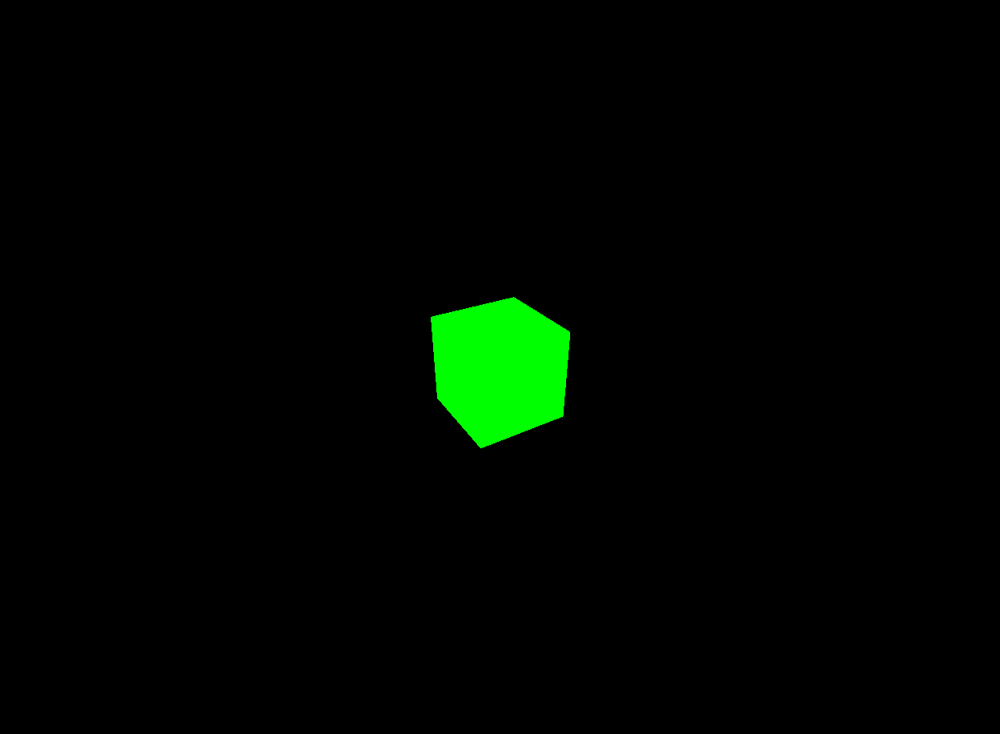

# Playing around with Three.js
with Three.js u can make 3d objects in the webrowser and even animate them.:open_mouth:  

[Link](https://sam-guliker.github.io/TO_Three.js/index.html) to the webpage.  


## Creating a scene.
To create anything with [three.js](https://threejs.org/) We need three things.  
A scene, camera and renderer, so we can render the scene with the camera.:eyes:

```Javascript
var scene = new Three.Scene();
var camera = new THREE.PerspectiveCamera(75, window.innerWidth/window.innerHeight, 0.1, 1000)

var renderer = new Three.WebGLRenderer()
renderer.setSize(window.innerWidth, window.innerHeight)
document.body.appendChild(renderer.domElement)
```

Mhmmm:thinking:  
Whats going on!?  

```Javascript

var scene = new Three.Scene();
var camera = new THREE.PerspectiveCamera(75, window.innerWidth/window.innerHeight, 0.1, 1000)

```
### Camera
There are different camera's in three.js but Im using `PerspectiveCamera`
the first attribute is the `Field Of View` which is 75.  FoV is the extent of the scene that is seen on the   display at any given moment. The value is in degrees.

The second value is the aspect ratio. You always want to use the width  of the element devided by the height.
or you'll get the  same result as when you play old movies on a widescreen TV  - the image looks squished.

The next two attributes are the near and far clipping plane.  What that means, is that objects further away from the camera than  the value of far or closer than near won't be rendered.  


### Renderer
Now the renderer :innocent:  
```Javascript

var renderer = new Three.WebGLRenderer()
renderer.setSize(window.innerWidth, window.innerHeight)
document.body.appendChild(renderer.domElement)

```
Time for magic :sparkles: :grinning:  
We are using `WebGLRenderer` which is made by [WebGL](https://get.webgl.org/)  Three.js comes with a few others, it is used for fallbacks  for users with an older browser who don't have WebGL suported.  

In order to set the renderer instance, we need to set the size which we want it to render it to.  
I'm using full screen but for some app's it maybe usefull to make a smaller size.  
you can dostuff like 
```Javascript 
setSize(window.innerWidth/2, window.innerHeight/2, false)
```  
This will render it at half size.
And for the last part we append the renderer to our HTML document.  
This is a `<canvas>` element.  

### Cube
Creating the cube and placing it.:triangular_ruler:
```Javascript 
var geometry = new THREE.BoxGeometry( 1, 1, 1 );
var material = new THREE.MeshBasicMaterial( { color: 0x00ff00 } );
var cube = new THREE.Mesh( geometry, material );
scene.add( cube );

camera.position.z = 5;
```
To create a cube, we need `BoxGeometry` his is an object that  contains all the points (vertices) and fill (faces) of the cube.  

We're using `MeshBasicMaerial` for the material and give it a color attribute which is green.  
This works the same as css.:v:  

The third `Mesh` is an object that takes a geometry, and applies it  to a material.  
Which we can then insert to our scene, and move freely around:dazzled:

By default, when we call `scene.add()`, the thing we add will be  added to the coordinates `(0,0,0)`. This would cause both the camera  and the cube to be inside each other. To avoid this, we simply  move the camera out a bit.

### Rendering the scene
We need a function that renders our scence. We need a `render` or `animate`loop  
```Javascript
function animate() {
	requestAnimationFrame( animate );
	renderer.render( scene, camera );
}
animate();
```

### Animating the cube
We got the cube in our screen now, but we want  it to animate. :smirk:  
You should place this right above the renderer.render call in the animate function.
```Javascript 
cube.rotation.x += 0.1;
cube.rotation.y += 0.1;
```
This will run every frame(60 times per second), and give the cube a nice rotation.

:fire: My first Three.js Object :fire:

## Sources
* [Documentation by Three.js](https://threejs.org/docs/index.html#manual/introduction/Creating-a-scene)

## License
Copyright © 2018 [Sam Guliker](https://github.com/Sam-Guliker). Released under the [MIT license](https://opensource.org/licenses/MIT)